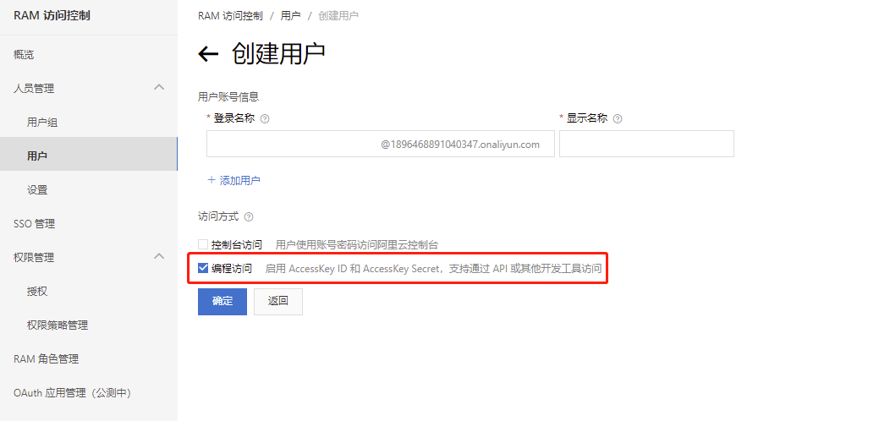
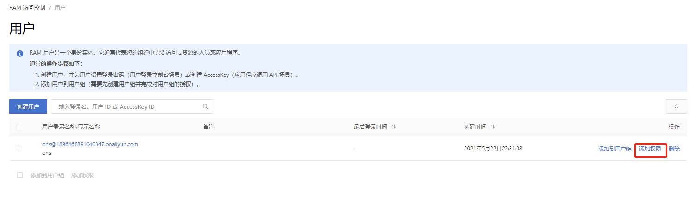
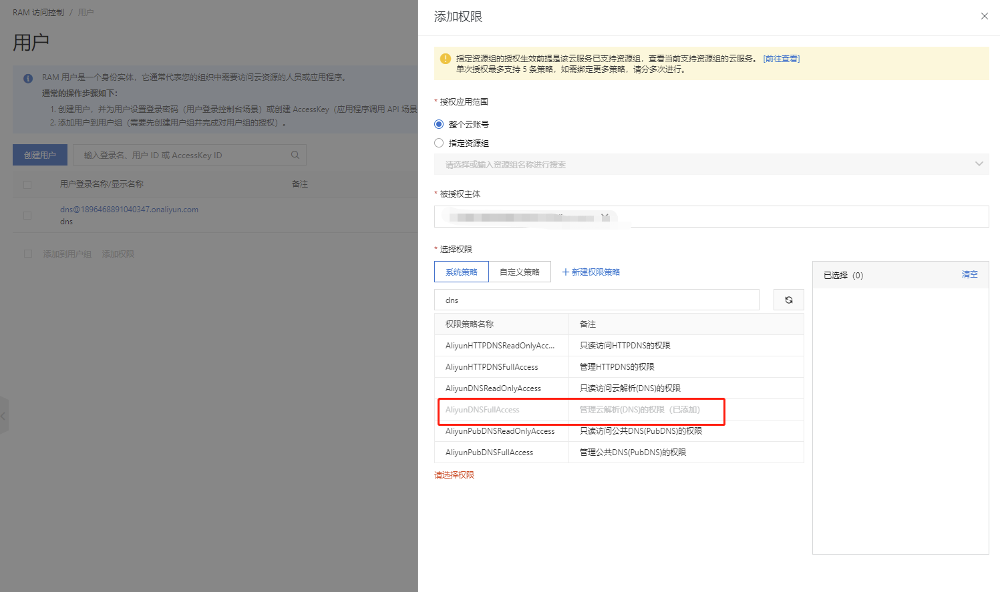

# CodePlus.AliyunDns

由于国内个宽带商基本无法对个人用户免费提供固定的公网IP地址，所以当我们需要通过公网IP映射域名的时候，就会出现IP总是会变，这个时候就需要用到域名动态解析。

## 配置发布环境
本项目基于.Net Core 3.1 ,所以对于发布环境也有要求，需要安装对应的.NET CORE 环境

[.Net Core 3.1.15 Hosting Bundle 官方下载地址](https://download.visualstudio.microsoft.com/download/pr/c8eabe25-bb2b-4089-992e-48198ff72ad8/a55a5313bfb65ac9bd2e5069dd4de5bc/dotnet-hosting-3.1.15-win.exe)

## 申请阿里云的AccessKey ID 和 AccessKey Secre
进入阿里云控制台，搜索 【访问控制】，左边导航点击【用户】=》【创建用户】，在创建用户页面勾上【编程访问】，这样才会启用 AccessKey ID 和 AccessKey Secret。


新建用户成功之后，在用户列表给用户分配权限，在弹出的页面选择系统策略，搜索【AliyunDNSFullAccess】策略并选择保存，新增成功后在列表页就能看到AccessKey ID 和 AccessKey Secret，拿到之后保存下来，后面再进去就看不到了



## 修改配置文件
```csharp
  "Jobs": {
    "DnsJob": {
      "IsEnable": true,
      "Cron": "0 00 09 * * ?" // 每天早上9点更新一次
    }
  },
  "AliYun": {
    "RegionId": "",
    "AccessKeyId": "", // 阿里云AccessKey
    "Secret": "" // 阿里云Secret
  },
  "Dns": {
    "DomainName": "codeplus.vip", // 要解析的域名
    "RRKeyWord": "m" // 要解析域名的记录值 m.codeplus.vip
  }
```
最后直接发布，可以基于NSSM 装成 windows 服务使用
